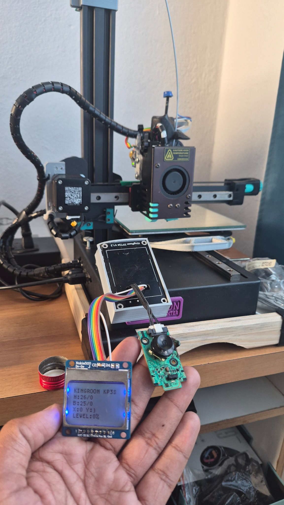
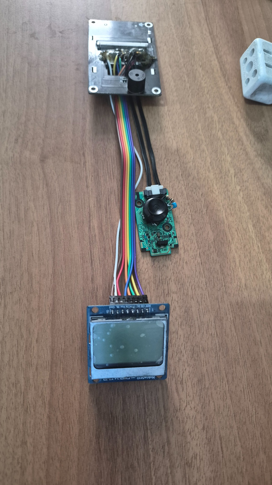
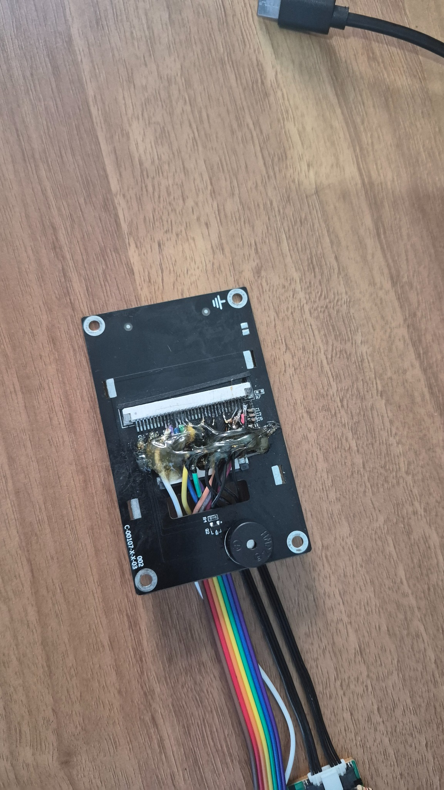
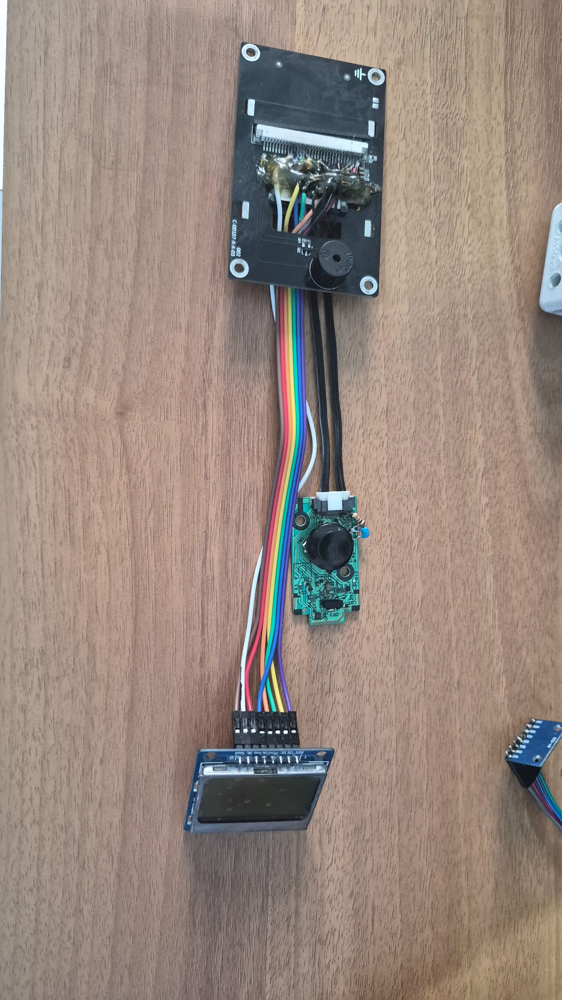

# [**Kingroon-KP3S-Marlin-Firmware**](https://github.com/Spidoug/Kingroon-KP3S-Marlin-Firmware)

**Kingroon KP3S — Marlin Firmware V1 / 1.0.0**

Custom **Marlin 2.1.3-b3** firmware for the Kingroon KP3S STM32F103VET6, built around a Nokia 5110 display, Samsung UE5000 control board, optional BLTouch, filament runout sensor and MPU6050 IMU with resonance-assisted Input Shaping.

<p align="center">
  
</p>

<p align="center"><strong>Kingroon KP3S Marlin Firmware V1 — real hardware prototype running the custom firmware.</strong></p>

## Project overview

This repository contains the single maintained **V1 / 1.0.0** firmware line. The build system starts from the official Kingroon KP3S Marlin configuration and applies the complete V1 hardware, interface, persistence and safety layer automatically.

The project replaces the original display/control workflow with a compact 84x48 Nokia UI and a repurposed Samsung BN41-01840B / BN96-22413B control board, while adding runtime hardware controls, multilingual menus, IMU telemetry and native Marlin motion tuning.

### Main features

- Nokia 5110 / PCD8544 84x48 graphical interface.
- Samsung UE5000 board for four-way navigation, CENTER action, IR receiver, LED and feedback.
- Selected long-label marquee constrained to the label field.
- Five runtime LCD languages.
- Mechanical Z-min retained on PA11.
- Optional BLTouch on PA8 with probe input on PC4.
- Filament runout input on PA4 with Advanced Pause / M600 support.
- MPU6050 software-I2C on PD8/PD9 with runtime SDA/SCL swap.
- Live fused level, boot inclination assessment, vibration and calibrated IMU die temperature.
- Guided level-zero calibration with live values.
- Resonance assistant with automatic homing, active ~200 Hz MPU capture and native Marlin Input Shaping application.
- Linear Advance, Firmware Retract, babystepping, Z-offset wizard and PID controls.
- Power-loss recovery support, disabled by default.
- Serial printing / transfer helper and host telemetry.
- Persistent V1 runtime settings in EEPROM.
- Lossless logical standby: queued G-code wakes the interface instead of being discarded.

## Hardware gallery

<table>
  <tr>
    <td align="center" width="50%">
      <br>
      <sub>Nokia 5110 display and Samsung navigation board.</sub>
    </td>
    <td align="center" width="50%">
      <br>
      <sub>Rear wiring of the modified control panel / FFC interface.</sub>
    </td>
  </tr>
  <tr>
    <td colspan="2" align="center">
      <br>
      <sub>Complete V1 control-panel hardware assembly.</sub>
    </td>
  </tr>
</table>

## Hardware

| Function | V1 connection |
| --- | --- |
| Nokia DIN | PD14 / FFC3 |
| Nokia CS / CE | PD7 / FFC19 |
| Nokia DC | PD11 / FFC20 |
| Nokia CLK | PD5 / FFC21 |
| Nokia RST | PC6 / FFC23 |
| Nokia backlight | PD13 / FFC24 |
| Samsung KEY1 | PE10 / FFC10 |
| Samsung KEY2 | PE13 / FFC13, with 1k series + 100nF to GND |
| Samsung IR | PE7 / FFC7 |
| Samsung LED | PD10 / FFC18 |
| Mechanical Z-min | PA11 |
| BLTouch control | PA8 |
| BLTouch probe | PC4 |
| Filament runout | PA4 |
| MPU6050 physical pair | PD8 / FFC16 + PD9 / FFC17 |

See [`docs/pinout.md`](docs/pinout.md) and [`docs/samsung-control-board.md`](docs/samsung-control-board.md) for the complete wiring reference.

## V1 interface

`Configuration > KP3S Setup` is organized into **Display**, **Motion / Tuning**, **Sensors / IMU**, **BLTouch / Leveling**, **Recovery**, **Storage** and **About**.

Long labels scroll slowly only while selected and only inside their reserved field, so submenu arrows and editable values remain fixed. The same behavior is used for long edit labels and supports UTF-8 text.

The MPU6050 provides live fused level, startup inclination assessment, toolhead vibration, calibrated IMU die temperature and resonance measurement. During normal printing the IMU does not directly modify individual G-code moves. Its motion influence comes from a calibrated frequency applied through Marlin's native Input Shaping implementation.

## Build

On Windows, run:

```text
firmware/BUILD_FIRMWARE.bat
```

A successful local build creates:

```text
firmware/firmware_output/FLASH_KP3S/Robin_nano.bin
```

The build script downloads the exact Marlin 2.1.3-b3 source and official KP3S configuration, applies all V1 changes, checks the required V1 invariants and compiles the STM32 firmware.

## Prebuilt firmware

Validated release binaries can be stored in:

```text
firmware/prebuilt/
```

This directory is intentionally part of the repository even when no binary is present. When a release binary is published, the bootloader-ready filename should be:

```text
firmware/prebuilt/Robin_nano.bin
```

Only binaries built from a known V1 source state and tested on the target hardware should be committed there. See [`firmware/prebuilt/README.md`](firmware/prebuilt/README.md).

## Flash

1. Format a reliable microSD card as FAT32.
2. Copy only `Robin_nano.bin` to the card root.
3. Power the printer off.
4. Insert the microSD card.
5. Power the printer on and allow the bootloader to process the file.
6. Power the printer off before removing the card.
7. Verify endstops, temperatures, heaters, fans, motion direction and Z/probe behavior before the first print.

## Safety and persistence

The builder enforces a V1 safety contract on the generated Marlin tree. It refuses to proceed if essential hotend/bed thermal protection, cold-extrusion prevention, required X/Y/Z endstop inputs or configured temperature limits disappear.

Display orientation, BLTouch runtime state, MPU enable/wiring, IMU temperature offset and level-zero calibration are EEPROM-backed. Native Marlin Input Shaping values are persistent as well. EEPROM-mutating `M500`, `M501` and `M502` are blocked while an active or paused print is detected.

The internal V1 EEPROM schema is **V10**. The public firmware identity remains **V1 / 1.0.0**.

After the first flash of this V1 schema, verify machine-specific PID values, steps/mm, Z-offset, motion limits and other calibration values before unattended printing.

## Documentation

- [`docs/firmware-v1.md`](docs/firmware-v1.md) — V1 behavior and menu structure.
- [`docs/architecture.md`](docs/architecture.md) — architecture and safety rules.
- [`docs/build-and-flash.md`](docs/build-and-flash.md) — complete build / flash workflow.
- [`docs/mpu6050.md`](docs/mpu6050.md) — IMU behavior, level and calibration.
- [`docs/resonance-tuning.md`](docs/resonance-tuning.md) — resonance-assisted Input Shaping.
- [`docs/bltouch.md`](docs/bltouch.md) — optional BLTouch operation.
- [`docs/filament-runout.md`](docs/filament-runout.md) — filament sensor behavior.
- [`docs/serial-print.md`](docs/serial-print.md) — serial printing / transfer support.
- [`docs/navigation.md`](docs/navigation.md) — Samsung control-board navigation.
- [`docs/troubleshooting.md`](docs/troubleshooting.md) — troubleshooting reference.

## Version

**Kingroon-KP3S-Marlin-Firmware — V1 / 1.0.0**
